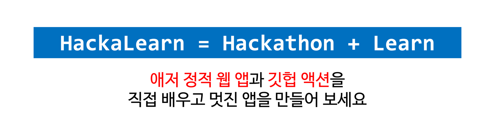
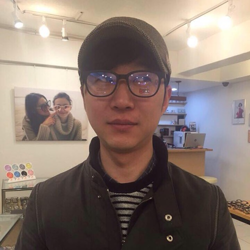
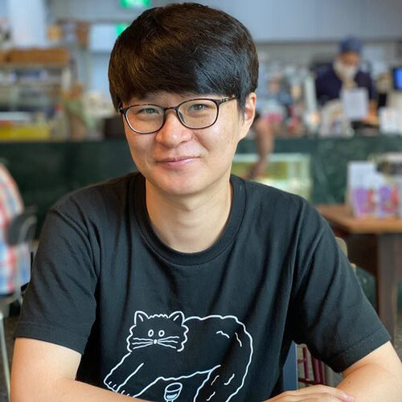
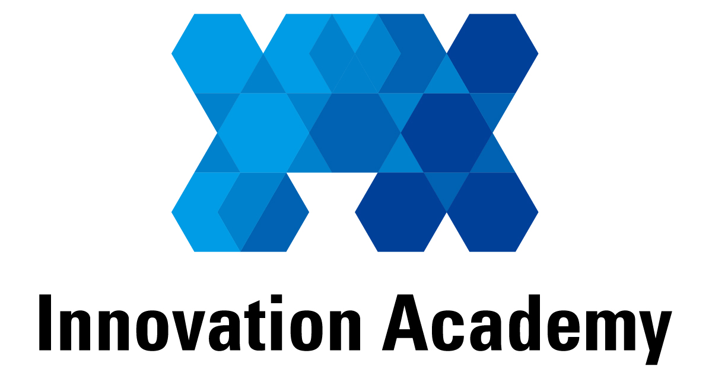
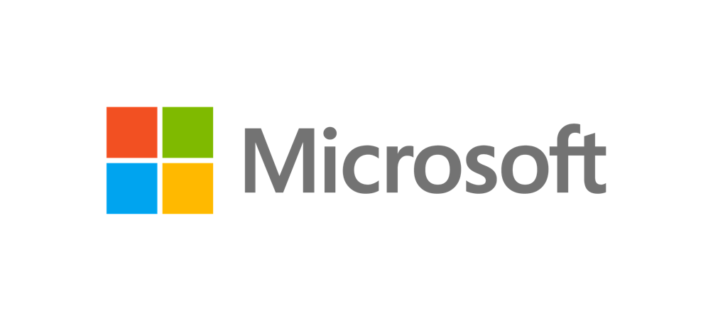

# HackaLearn x 42 Seoul #

    

HackaLearn은 Hackathon + Learn의 합성어로 주어진 기간 안에 관련 지식을 직접 배워서 해커톤에 적용하는 이벤트입니다. 이번 HackaLearn 이벤트의 주제는 바로 [애저 Bicep][bicep]과 [애저 정적 웹 앱(Azure Static Web Apps)][aswa], 그리고 [깃헙 액션(GitHub Actions)][gha]입니다. 2주간 공부하고 직접 웹 애플리케이션을 만들어 보는 HackaLearn 이벤트! 멋진 애플리케이션을 만들어 보세요! 푸짐한 상품이 기다립니다.

   
  <!--  -->
  
   

## 🏅 HackaLearn 수상자 및 수상팀 ##

TBA

## ⏰ 일정 ##

* 참가 신청기간: 2021년 11월 1일 0시 - 2021년 11월 19일 24시
* 결과제출 마감기한: 2021년 11월 20일 24시
* 심사 기간: 2021년 11월 22일 - 24일
* 전시회: 2021년 12월 3일
* 수상자 발표: 2021년 12월 3일

## 🙆🏻‍♀️ 참여 자격 ##

* 42서울 카뎃이라면 누구나 가능합니다!

## 🏃🏻‍♂️ 참여 방법 ##

1. HackaLearn 이벤트에 참가 신청합니다.
2. 아래 제시한 챌린지 미션을 모두 완료합니다.
3. 챌린지 미션을 완료할 때 마다 PR을 생성하여 운영진에게 제출합니다.
4. 챌린지 도중 궁금한 사항이 있을 땐 언제든 [질문/답변][qna] 방을 이용해 주세요.

## ✅ 챌린지 미션 ##

총 **일곱 가지 챌린지 미션**을 완료해야 합니다. 전체 챌린지 미션은 아래와 같습니다.

1. **클라우드 스킬 챌린지 #1** 👉 애저 Bicep
2. **클라우드 스킬 챌린지 #2** 👉 애저 정적 웹 앱
3. **클라우드 스킬 챌린지 #3** 👉 깃헙 액션
4. **SNS 인증 챌린지**
5. **웹 애플리케이션 챌린지**
6. **깃헙 저장소 챌린지**
7. **블로그 후기 챌린지**

## 👑 명예의 전당 Hall of Fame ##

**일곱 가지 챌린지 미션**을 모두 완료한 팀은 명예의 전당에 기록이 됩니다.

## 🏆 개별 챌린지 완수 ##

일곱 가지 챌린지 미션을 모두 완수하지는 못했지만, 개별 챌린지를 완수하신 분들 역시 기록이 됩니다.

* **클라우드 스킬 챌린지 &ndash; 애저 Bicep, 애저 정적 웹 앱 & 깃헙 액션 &ndash; 완수**
* **SNS 챌린지 완수**
* **애저 정적 웹 앱 URL 챌린지 완수**
* **깃헙 리포지토리 챌린지 완수**
* **블로그 포스트 챌린지 완수**

## 💻 핸즈온 랩 세션 ##

HackaLearn 기간 중 다양한 핸즈온 랩 세션을 준비했습니다. 함께 애저 Bicep, 애저 정적 웹 앱, 깃헙 액션을 만들어 보고 여러분의 애플리케이션 개발에 적용시켜 보세요!

### 사전 워크샵 ###

| 제목 | 일시 | 스트리밍 | 슬라이드 | 샘플코드 |
| :--: | :--: | :--: | :--: | :--: |
| 애저 Bicep으로 애저 인프라 구성하기 #1 | 2021년 11월 2일 (화) 8pm | 라이브 | 슬라이드 | 소스 코드 |
| 깃헙 액션 만들기 #1 | 2021년 11월 3일 (수) 8pm | 라이브 | 슬라이드 | 소스 코드 |
| 애저 정적 웹 앱 만들기 #1 | 2021년 11월 4일 (목) 8pm | 라이브 | 슬라이드 | 소스 코드 |
| 정적 웹 앱으로 블로그 사이트 만들기 #1 | 2021년 11월 5일 (금) 8pm | 라이브 | 슬라이드 | 소스 코드 |

### 이벤트 워크샵 ###

| 제목 | 일시 | 스트리밍 | 슬라이드 | 샘플코드 |
| :--: | :--: | :--: | :--: | :--: |
| 애저 Bicep으로 애저 인프라 구성하기 #2 | 2021년 11월 9일 (화) 8pm | 라이브 | 슬라이드 | 소스 코드 |
| 깃헙 액션 만들기 #2 | 2021년 11월 10일 (수) 8pm | 라이브 | 슬라이드 | 소스 코드 |
| 애저 정적 웹 앱 만들기 #2 | 2021년 11월 11일 (목) 8pm | 라이브 | 슬라이드 | 소스 코드 |
| 정적 웹 앱으로 블로그 사이트 만들기 #2 | 2021년 11월 12일 (금) 8pm | 라이브 | 슬라이드 | 소스 코드 |

## 🛠 개발 도구 사전 준비사항 ##

* HackaLearn 기간 중 다양한 개발 도구 및 무료 계정을 사용해야 하는데요, 아래 링크를 통해 참가자의 운영체제에 맞는 개발 도구를 선택해서 사용할 수 있습니다. 👉 [개발 도구 사전 준비사항 보러가기][tools]
* Git 혹은 GitHub 자체에 익숙해지고 싶으신가요? 여기 잘 정리된 비디오가 있습니다. 👉 [오픈소스 소통을 위한 Git 공부하기][git yt]

## 🧑🏻‍🏫 기술 멘토 ##

HackaLearn 기간중 챌린지를 완수하기 위한 기술적인 문제들에 대해 궁금한 점이 있으신가요? 여기 MLSA와 GCE를 비롯한 캠퍼스 기술 전문가와 클라우드 아드보캇 및 다양한 현장 전문가 분들께서 여러분들이 HackaLearn 기간중 겪는 여러가지 기술적인 문제 해결에 멘토링을 해 주실 예정입니다.
 

|  |  |  |  |  |
| :---: | :---: | :---: | :---: | :---: |
| 일반 [유저스틴 멘토](./mentors#justinyoo) 마이크로소프트 &nbsp; &nbsp; &nbsp; &nbsp; &nbsp; &nbsp; &nbsp; &nbsp; | 기획 [김수정 멘토](./mentors#suekim) Angelhack &nbsp; &nbsp; &nbsp; &nbsp; &nbsp; &nbsp; &nbsp; &nbsp; | UX [박정은 멘토](./mentors#aimeepark) IBM &nbsp; &nbsp; &nbsp; &nbsp; &nbsp; &nbsp; &nbsp; &nbsp; | 프론트엔드 [임진호 멘토](./mentors#jaylim) 마켓컬리 &nbsp; &nbsp; &nbsp; &nbsp; &nbsp; &nbsp; &nbsp; &nbsp; | 백엔드 [양민호 멘토](./mentors#minhoryang) 커먼컴퓨터 &nbsp; &nbsp; &nbsp; &nbsp; &nbsp; &nbsp; &nbsp; &nbsp; |

## 🏅 시상 부문 ##

TBA

## 🏆 시상품 ##

TBA

## 🎭 개인정보 보호정책 ##

HackaLearn에서는 여러분의 개인 정보를 소중히 여깁니다. 개인 정보 보호와 관련한 자세한 내용은 [개인정보 보호정책][privacy] 페이지를 참고해 주세요.

## 👨‍👩‍👧‍👦 행동 강령 Code of Conduct ##

HackaLearn에서는 참가자 여러분들 모두가 행사 기간 중 마음 편안하게 참여하실 수 있게끔 모두에게 공정하고 상호 존중하도록 행동 강령을 정하고 있습니다. 좀 더 자세한 내용은 [행동 강령][coc] 페이지를 참고해 주세요.

## 🥑 주관 및 후원 ##

이 행사는 [이노베이션 아카데미](https://innovationacademy.kr/)에서 주관하고 [마이크로소프트](https://www.microsoft.com/ko-kr?WT.mc_id=dotnet-47615-juyoo&ocid=AID3035086)에서 후원합니다.

| 주관 | 후원 |
| :--: | :--: |
|  |  |

[bicep]: https://aka.ms/42s/bicep/intro
[aswa]: https://aka.ms/42s/aswa/intro
[gha]: https://aka.ms/42s/gha/intro

[rego]: http://aka.ms/42s/register
[submit]: https://aka.ms/42s/submit
[qna]: https://aka.ms/42s/qna
[hof]: HALL_OF_FAME.md
[privacy]: https://aka.ms/42s/privacy
[coc]: https://aka.ms/42s/coc
[microsoft]: assets/logo-microsoft.png
[tools]: ./tools
[git yt]: https://www.youtube.com/playlist?list=PLDZRZwFT9WktMraaU2KPeU8nPx5O1CXv_

[live bicep 1]: https://youtu.be/Hxkv6AjAisY
[live gha 1]: https://youtu.be/Hxkv6AjAisY
[live aswa 1]: https://youtu.be/e_elLW6uNSc
[live all 1]: https://youtu.be/x3j3mDblqMY

[live bicep 2]: https://youtu.be/Hxkv6AjAisY
[live gha 2]: https://youtu.be/Hxkv6AjAisY
[live aswa 2]: https://youtu.be/e_elLW6uNSc
[live all 2]: https://youtu.be/x3j3mDblqMY
