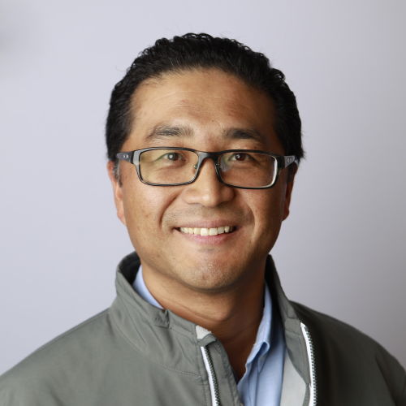
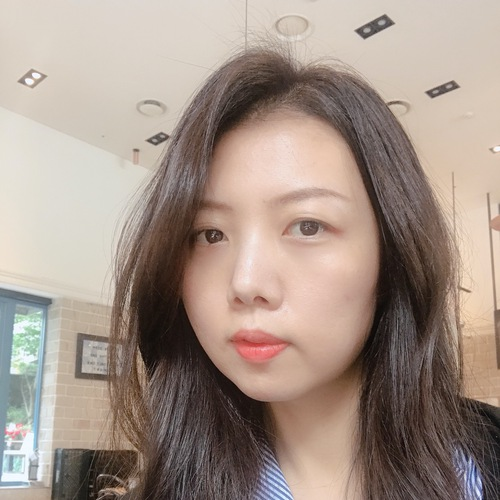

# HackaLearn x 42 Seoul 멘토 ##

## 유저스틴 멘토 &ndash; 일반 ##

  

> 마이크로소프트에서 시니어 클라우드 아드보캇으로 일하고 있습니다. 2015년부터 Microsot MVP로 활동하면서 Deloitte 과 같은 글로벌 컨설팅 펌에서 수석 컨설턴트로 활동했습니다. 클라우드 특히 서버리스와 인티그레이션 분야에 아주 관심이 많습니다.

## 김수정 멘토 &ndash; 기획 ##

  

> 안녕하세요. 김수정입니다. 글로벌 해커톤 Angelhack Seoul을 운영하면서 해커톤 운영 및 멘토 경험을 쌓았습니다. 현재 영어 교육 앱 회사인 퀄슨에서 Product owner 로 재직 중입니다. 기획 분야와 관련해 많은 질문 부탁드려요! :D

## 박정은 멘토 &ndash; UX ##

  

> 사람과 사람, 사람과 기술을 연결하는 일을 하고있는 박정은 입니다. Service design, UX를 공부했고 지금은 IBM Garage designer로 즐겁고 바쁜 시간을 보내고 있습니다. 사람을 위한 IT 서비스를 잘 하고싶고 저와 같은 고민을 하는 분들과 경험을 공유하고 싶습니다.

## 임진호 멘토 &ndash; 프론트엔드 ##

  

> 마켓컬리 물류 조직에서 프론트엔드 개발을 하고 있습니다. 비전공자로 남들 보다 늦은 나이에 개발을 시작했지만 LESS(Learn, Enjoy, Solve, Share)한 삶을 살아가고 있습니다.

## 양민호 멘토 &ndash; 백엔드 ##

  

> 안녕하세요 양민호 개발자입니다.
>
> 백엔드 개발을 좋아합니다. 보이지 않는 부분에서 마법과 같은 경험을 설계하는 것을 좋아합니다. 취미로 오픈소스활동을 하고 있습니다. AI + Blockchain 스타트업 커먼컴퓨터에서 가치의 인터넷이라는 미래를 설계하고 있습니다.

